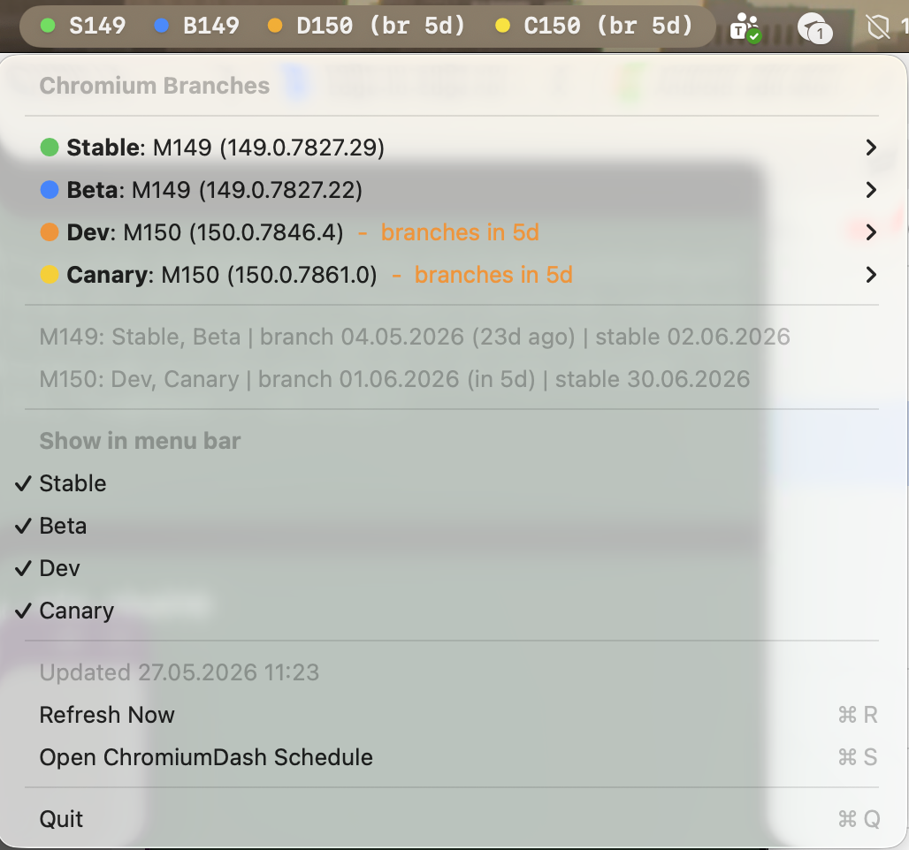

# ChromiumDash Menubar

Tiny macOS menu bar app for quickly answering: which Chrome milestone is Stable, Beta, Dev, or Canary, and when did/will it branch or ship?

Data sources:

- Channel versions: `https://versionhistory.googleapis.com/v1/chrome/platforms/mac/channels/...`
- Milestone schedule: `https://chromiumdash.appspot.com/fetch_milestone_schedule`
- Schedule UI: `https://chromiumdash.appspot.com/schedule`

Inspired by Chromium issue: https://issues.chromium.org/issues/515480635

## Screenshot



## Install

Download the latest macOS zip from:

https://github.com/hjanuschka/chromiumdash-menubar/releases

Unzip it and open `Chromium Branches.app`.

## Build

```bash
./scripts/build-app.sh
```

The app bundle is written to:

```text
.build/Chromium Branches.app
```

## Run

```bash
open ".build/Chromium Branches.app"
```

It is an `LSUIElement` app, so it only appears in the macOS menu bar.

## What it shows

The menu bar title summarizes the current main channels, for example:

```text
Cr S149 B149 D150
```

The menu shows:

- Stable, Beta, Dev, Canary current versions for macOS
- Milestone branch point
- Beta start/end
- Final beta cut
- Stable date
- Stable refresh dates when present
- Links to ChromiumDash schedule and issue 515480635

The app refreshes at launch, on demand, and every hour.

## Release

```bash
./scripts/release.sh 0.1.0
```

This builds `.build/releases/ChromiumBranches-macOS-0.1.0.zip` and publishes it to GitHub Releases when `gh` is authenticated.
